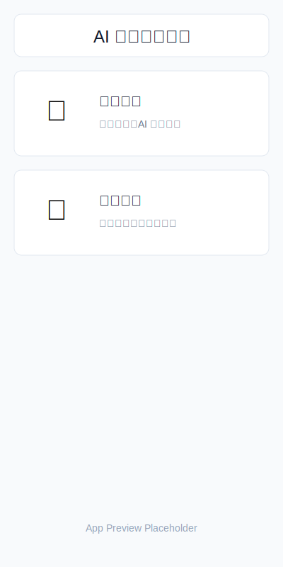
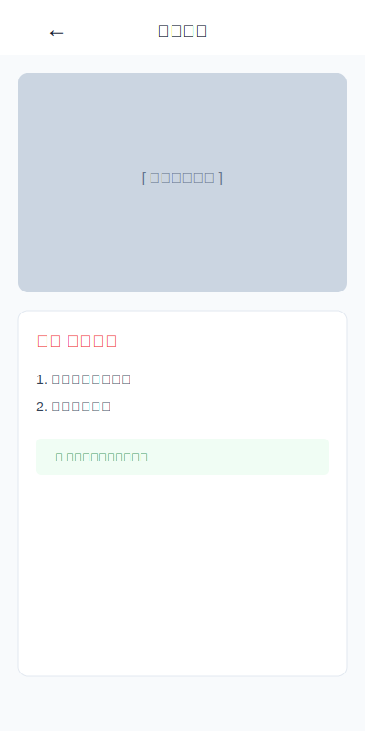
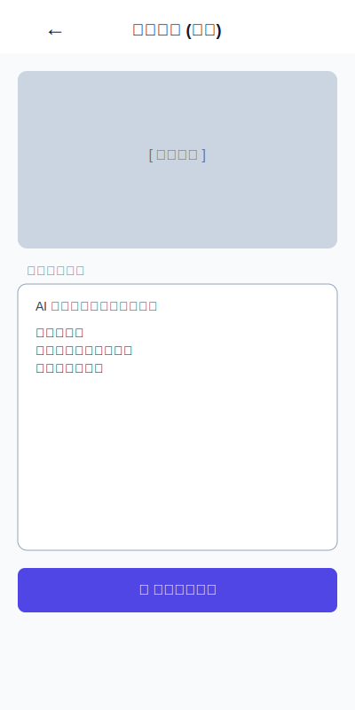
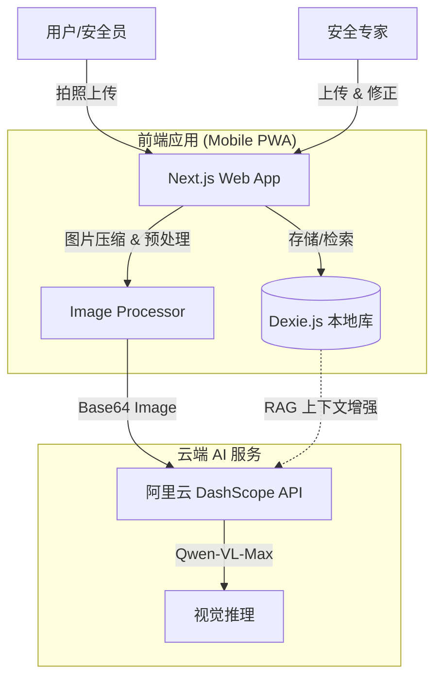

# 🛡️ AI 隐患识别系统 (AI Safety Guard)

> 基于国产大模型（阿里云通义千问-VL）的智能安全隐患识别系统。
> 专为移动端设计，支持现场拍照上传，AI 实时分析隐患并给出整改建议。

## ✨ 项目演示 (Screenshots)

| 首页 (Home) | 隐患排查 (Scanning) | 模型训练 (Training) |
|:---:|:---:|:---:|
|  |  |  |

*(注：以上为功能示意图。实际部署后，建议替换为真实运行截图 home.png, scan.png, train.png)*

## 🚀 核心功能

### 1. 🔍 智能隐患排查 (User Mode)
*   **即时分析**: 用户在现场直接拍照或上传图片。
*   **AI 诊断**: 调用 Qwen-VL-Max 模型，识别画面中的不安全行为（如未戴安全帽、梯子不稳、明火隐患等）。
*   **RAG 增强**: 自动检索专家知识库中的类似案例作为上下文，确保分析结果符合企业安全标准。
*   **整改建议**: 输出具体的隐患描述及专业的整改措施。

### 2. 🧠 专家知识库构建 (Expert Mode)
*   **人机协作**: 专家上传典型隐患图片，AI 预先分析。
*   **知识校准**: 专家对 AI 的分析结果进行修正和补充。
*   **持续进化**: 修正后的数据存入本地数据库 (IndexedDB)，成为后续 AI 推理的“教科书”。

## 🛠️ 技术栈

*   **Frontend**: [Next.js 14](https://nextjs.org/) (App Router), [React](https://react.dev/), [TypeScript](https://www.typescriptlang.org/)
*   **UI/UX**: [Tailwind CSS](https://tailwindcss.com/), [Lucide Icons](https://lucide.dev/), Mobile-First Design
*   **AI Engine**: 阿里云 Qwen-VL-Max (via [OpenAI SDK](https://github.com/openai/openai-node))
*   **Database**: [Dexie.js](https://dexie.org/) (Browser-based IndexedDB)

## 🏗️ 系统架构



## 🏁 快速开始

### 1. 环境准备
*   Node.js 18+
*   阿里云百炼控制台 API Key ([获取地址](https://dashscope.console.aliyun.com/apiKey))

### 2. 安装依赖

```bash
cd web
npm install
```

### 3. 配置环境变量

复制 `.env.local` 文件并填入你的 API Key：

```bash
# web/.env.local
DASHSCOPE_API_KEY=sk-xxxxxxxxxxxxxxxxxxxxxxxxxxxxxxxx
```

### 4. 启动开发服务器

```bash
npm run dev
```

打开浏览器访问 `http://localhost:3000`。
> 💡 **提示**: 建议在 Chrome 开发者工具中开启“移动端模拟模式” (Toggle Device Toolbar)，选择 iPhone 12/14 Pro 以获得最佳预览效果。

## 📂 目录结构

```
web/
├── app/                  # Next.js 页面路由
│   ├── scan/             # 用户扫描页 (User Interface)
│   ├── train/            # 专家训练页 (Expert Interface)
│   └── actions.ts        # Server Actions (API Calls)
├── components/           # 复用 UI 组件 (ImageUploader 等)
├── lib/
│   ├── ai/               # AI 服务封装 (QwenManager - OpenAI Compatible)
│   └── db/               # 本地数据库操作 (TrainingDB)
└── ...
```

## 📄 License

MIT © 2026 AI Safety Guard
